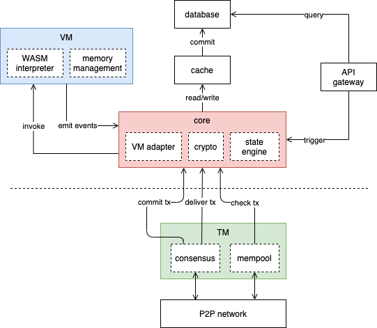
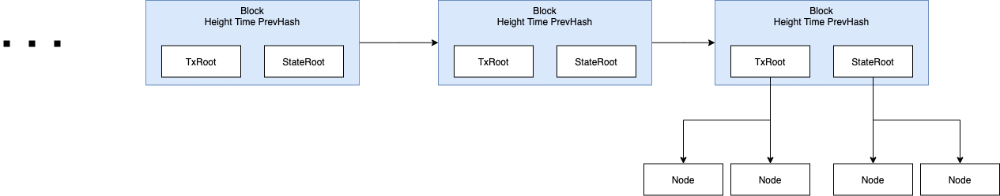
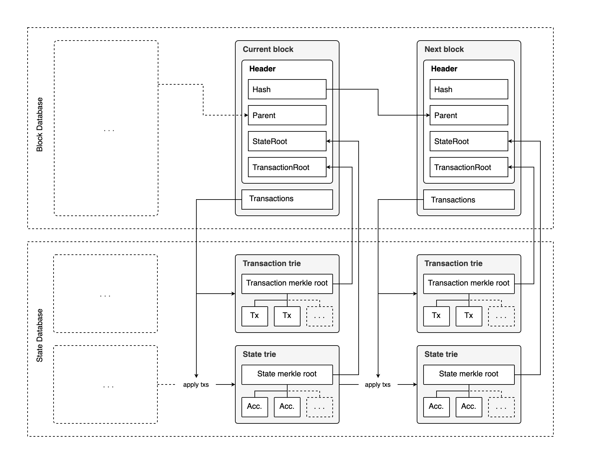

# Liquid Chain


## Introduction

Blockchain in general consists of two major building blocks. First is a state machine dictating how data changes from one state to the next. Second is a consensus engine to reach agreement on that canonical next state.

In 2009 Bitcoin started the blockchain craze with its Transaction-based state machine and Proof-of-Work consensus (PoW). Six years later Ethereum was born using the same PoW but with a much-improved state machine, becoming first blockchain to offer an easy-to-use smart contract platform with an extensive ecosystem. 

A couple of years in, the number of applications developed on Ethereum is still every small compared to the vast non-blockchain applications. Some blames Solidity - Ethereum's sole programming language - and its tooling for being immature compared to its off-chain counterparts. Others blame network speed and fees.

In this article we are introducing a new class of blockchain that is capable of running applications developed in a wide range of well-established programming languages, backed by a high-performance Proof-of-Stake consensus engine. 

The system consists of four building blocks: Consensus, Virtual Machine, Storage, and Blockchain Core. The following sections we will explore each of these components in detail





## Consensus

### Tendermint PBFT

While PoW in principle also enables decentralized the execution of smart contracts, a high-performance smart contract platform only makes sense when it is accompanied by a low-latency consensus engine.

Given the properties we look for in a consensus engine, Tendermint is the better choice out there:

- Low-latency: Tendermint BFT Proof-of-Stake has mean block time of just 1-3 seconds [1]
- Fair: Every round a block proposer is selected using weighted round-robin
- Secure: The network cannot be compromised if less than 1/3 of the validators are malicious (BFT property)
- Decouple: The consensus does not require internal knowledge of the state machine in order to perform correctly

Though Tendermint is our default consensus engine, Liquid Chain is designed so that consensus engine is decoupled and replaceable. State machine interacts with Tendermint consensus via their Application BlockChain Interface (ABCI). This allows future enhancement in the consensus department and enabled aspiring developers to experiment other consensus model on of top Liquid Chain state machine.

### Absolute Finality

In PoW consensus systems like Bitcoin or Ethereum a transaction finality is probabilistic. Meaning there is a small chance that the transaction could be reverted. This probability decreases as the block containing this transaction gets deeper into the chain. This is why it is common to recommend 6-block wait time before accepting transactions on these networks. 

Different DApps can have different preferences with regard to finality. However a long confirmation time could limit the type of financial applications run on blockchain. Time-sensitive financial applications like trading system often requires its transactions to be finalized sooner than later. 

Therefore absolute finality at 1-block is a characteristic we deem important in a consensus system. Fortunately Tendermint achieves this thanks to its implementation of PBFT. [2]

In the next sections we will dive into Liquid Chain's state machine, broken down to: 

- Virtual Machine: Smart Contract Execution Unit
- Blockchain Core: Coordinating different components of the state machine
- Storage: Indelible storage for smart contact data


## Virtual Machine

The virtual machine (VM) is the core of Liquid Chain state machine. It enables smart contract execution, moving blockchain states from one to another. As the execution unit it must have the following properties:

- Versatile: Developers should be able to deploy and run contracts written in a wide range of development languages 
- High-performance:  The VM must have low execution latency comparable to native counterparts
- Secure: All changes made by the VM only impact a sandboxed, isolated environment. No one can use their smart contracts to exploit the host environment
- Runtime-limit: The VM computation load should come with an associated cost to control resource exploitation
- Deterministic: The VM execution in different nodes, systems, architectures must yield the exact same result

### The programming language

One of the biggest challenges for blockchain application development is language adoption. Even with Ethereum being the largest smart contract blockchain, Solidity development ecosystem is still very small and lacks the tooling and performance tuning often seen in the more popular, proven track record none-blockchain languages. 

This is where WebAssembly, or WASM for short, comes into play. WASM is an open language standard designed to be the compiled target of other languages. Meaning developers can develop smart contract on various languages and compile that to WASM binary. This makes WASM extremely **versatile** and the perfect candidate for our VM's native language. 

WASM is originally designed to bring native app performance to the web [3], hence is **high-performance**. 

Each WASM module executes **securely** within a sandboxed environment [4]. This means application can only modify its internal state and cannot affect host environment without going through controlled APIs

Though there is no Web spec dictating **runtime-limit**, the fact that WebAssembly has opcode-by-opcode execution is a very important characteristic to control VM load by associating opcode executions with costs

It gets a bit tricky when it comes to determinism. While most of WebAssembly spec is deterministic, floating point NaN handling is an exception [5]. In Liquid Chain we resolve this issue by adding an additional requirement to the spec specifying canonical presentation for 32-bit and 64-bit NaN values following IEEE 754–2008 revision. With **determinism** taken care of, WebAssembly is fully ready for blockchain. 

With WebAssembly equipped, the blockchain toolkit will support C/C++ and Rust out of the box. Down the line we will add support for other languages whose WASM compilation is mature and complete 

### Bytecode Execution

The goal is to design a VM capable to correctly and effectively execute an WASM binary under pre-specified runtime-limit

#### Stack Machine

The WASM VM is a stack machine. All stack elements are stored as uint64 and converted to the intended types depending on operation operand types

#### Frame - Keeping track of function

To keep track of functions the VM maintains a frame stack. 

Each frame represents a function in Wasm, containing its instruction bytecode

| F3 - Current function execution         |
| --------------------------------------- |
| F2 - Function that calls F3             |
| F1 - The initial function that calls F2 |

Each frame keeps track of a stack base pointer, pointing to the stack element that this function starts from. If the function has arguments, its starting stack elements are used to stored these arguments

For example stack view of the following function:

```assembly
(func myFunc (param i32 i32))
```

| Top of the stack                                  |
| ------------------------------------------------- |
| First operand starts here                         |
| Reserved for the second param                     |
| Frame base pointer - reserved for the first param |
| Previous function data                            |

At the end of its execution, the stack pointer will be moved back to this base pointer. If the function has return value, this value will be push to this base pointer

#### Block

Block is just WebAssembly way to have jump labels. Inside a block we can declare a *br* (or break) instruction, which if executed will jump to the block labels. Similar to a function, block can also return a value

There are 3 block types in WASM: 

- Vanila block - jump label is end of the block

- Loop block - jump label is start at the block

- If block - similar to vanila block, jump label is end of the block. However entry to this block type is conditional

Below is a vanila block example that returns 7

```assembly
block $B0
  i32.const 7
  block $B1
  	br $B0 ;; jump to $B0's end
  end ;; $B1 jump label
  i32.const 8
end ;; $B0 jump label
```


#### Jump strategy

##### Marking jump labels location

In other assembly languages, a jump instruction comes with a designated jump address, meaning we can move the instruction pointer directly to that jump label. WebAssembly however doesn't have this luxury. A WASM `br` only tells us which jump label we should get to, it does let us know where to find that jump label.

To solve this issue a VM can choose to make a pre-execution instruction traversal to find the addresses of all jump labels for an exected function. It then replaces `br` operand with the actual label address. Take above example:

```assembly
block $B0
  i32.const 7
  block $B1
  	br 15 ;; jump to 15, which is the instruction 
  end ;; $B1 jump label
  i32.const 8
end ;; instruction index 15
```

##### Instruction skipping 

Instead of making a pre-traversal to determine all jump addresses, one other approach is to simply skip all intermediate instructions if a `br` instruction is in effect. This skipping stops once the desired jump label is reached

```assembly
block $B0
  i32.const 7
  block $B1
  	br $B0 
  end 
  ;; i32.const 8 - ignored 
end 
```

In order to determine the correct jump label - `end` - the VM needs to maintain a block stack. Each block is popped out of the stack on an `end` keyword encounter. 

This particular design approach is called a one-pass since it only makes one traversal in order to execute the instructions.

### Interaction with host

Many functionalities do not lie with VM but rather residing outside. WASM allows a special type of function called imports. These imports can be mapped to actual function implementation in the host.

```assembly
(import "env" "external_add" (func $external_add (param i32 i32)))
(func $calc (export "calc") (type $t2) (result i32)
  i32.const 1
  i32.const 2
  call $external_add
)
```

### Memory Management

A WASM execution do not have direct access to the underneath physical memory but rather a linear memory structure managed by VM. 

**Data 1KB - Stack 64 KB - Heap Extendable**

It would be so simple if this memory is used only the VM. However in many circumstances, the caller will require access to this memory to either retrieve VM data or to pass external data to VM. The former is as simple as reading an array of an offset (pointer provided by VM). The later is tricker since host on its own cannot allocate memory to contain data. The solution for this problem is to leave all memory allocation management to VM. When external data need to be sent to VM, the host has to place the data to a memory pointer provided and allocated by VM.

Let's look at an example where a smart contract retrieve its data

VM

```c
extern "C" size_t get_storage_size(byte_t*);
extern "C" byte_t* get_host_storage(byte_t*, byte_t*);

byte_t* get_storage(byte_t* key_ptr) {
  int size = get_storage_size(key_ptr);
  byte_t* value_ptr = new byte_t[size]; 
  get_host_storage(key_ptr value_ptr);
  return value_ptr;
}
```

Host

```go
func getStorage(vm *VM, keyPtr uint32, valuePtr uint32) uint64 {
  key := vm.ReadAt(keyPtr) //get the actual key bytes
  value := storage.get(key) //get value for this key
  // notice how we do not need memory allocation for value anymore, since it already happened in Wasm
	vm.WriteAt(valuePtr, value) //write value to Buffer
	return valuePtr //return pointer back to Wasm
}
```

This model of memory management allows VM and Host to use the same extendable heap to exchange data.

There is one caveat: Function arguments passing. This is before the execution starts so it is impossible to get a memory pointer from VM. To resolve this issue an small memory segment is reserved for host to place its arguments 

1024 bytes end of the stack is reserved as argument passing buffer (APB):

**Data 1KB - APB 1KB - Stack 63 KB - Heap Extendable**

Liquid Chain implements the 32-bit version of wasm32 therefore linear memory sizes are limited to 4GB

### Runtime limit

Similar to Ethereum, Liquid Chain uses Gas to place computation limit on a contract execution. 

The VM itself does not have an internal Gas policy. It can however uses an external policy provided to the VM. Any policy that implements GasPolicy interface can be used:

```go
type GasPolicy interface {
	GetCostForOp(op opcode.Opcode) int64
}
```

## Blockchain Core

### Data Structures





The blockchain includes a series of blocks, each of which comprises of block serial information (height, time) and the root hashes of two [Merkle](#merkle-patricia-tree) trees, one for transactions and one for contract states.

The transaction tree contains information about user transactions as well as their execution constraints & results (receipts)

```go
type Transaction struct {
	Version   uint16
	Sender    *TxSender
	Receiver  *Address
	Payload   *TxPayload
	GasPrice  uint32
	GasLimit  uint32
	Signature []byte
	Receipt   *TxReceipt
}
```

The state tree stores data for all accounts in the blockchain, including their associated storages and contract bytes

```go
type AccountState struct {
	Nonce        uint64
	ContractHash []byte
	StorageHash  common.Hash
	Creator      crypto.Address
}
```

### Types

Liquid Chain supports the following types in contract function calls and returns

+ uint8, uint16, uint32, uint64

+ int8, int16, int32, int64

+ float32, float64

The above are called primitives. 

In addition, function calls also support arrays

+ array of primitives

+ address (alias for uint8[35])

### Execution Events

One of WASM limitations is its ability to communicate response. At its current spec, WASM can only returns a single primitive to the function caller. To bypass this limitation, Liquid Chain provides another communication channel via Events. 

Event is an execution log telling the caller details regarding the execution. The event can include multiple values able to return complex data structure. In Liquid Chain, developer can declare an event much like how they declare a function:

```c
Event Transfer(address from, address to, int amount);
```

Similarly, creating an event is exactly like calling a local function:

```c
void transfer(address destination, int amount) {
	address from = chain_get_caller();
  change_balance(from, -amount);
  change_balance(to, amount);
  Transfer(from, to amount);
}
```

After the execution, the event is embedded in its associated transaction and is accessible via API

### Contract ABI

To define the structure of a smart contract the WASM binary is not enough. WASM only by itself only supports integers and floats (32/64-bit numbers). For array-based datatype additional information needs to present when a contract is created. In Liquid Chain every WASM binary is accompanied by a JSON ABI file defining contract structure and datatype. The ABI file is generated automatically using the provided SDK.

```
{
  "version": 1,
  "events": [
    {
      "name": "Add",
      "parameters": [
        {
          "name": "from",
          "type": "address"
        },
        {
          "name": "to",
          "type": "address"
        },
        {
          "name": "amount",
          "type": "int32"
        }
      ]
    }
  ],
  "functions": [
    {
      "name": "transfer",
      "parameters": [
        {
          "is_array": false,
          "type": "address"
        },
        {
          "is_array": false,
          "type": "int32"
        }
      ]
    }
  ]
}
```

### Cross-Contract Calls

Reuse is one of the earliest software development practice. Nowadays to save time developers rarely build everything they need from scratch in a large monolithic application but rather opt into using various external services via internet-based protocols. An application on blockchain is not much different. On its own it often archives much less. Therefore it is crucial to provide a mechanism for contracts to interact with one another.

With Liquid Chain cross-contract call, invoking another contract function is much like invoking a local function. This is achieved via an intermediate binding step:

``` c
chain_method_bind(address contract, remote_func byte_t[], local_func byte_t[]);
```

Says we have a contract providing a mathematical function `variance`. Any other contract can utilize this function by binding a local aliased function to `variance`:

``` c
alias_int32 my_variance(int*);
void complex_math_ops(int* inputs){
  chain_method_bind(<math_contract_address>, "variance", "my_variance");
  var variance = my_variance(inputs)
}
```

Note that the binding is only valid within the execution. Separate calls require separate bindings. 

### Contract Compile Target

By default WASM compile into `wasm32-unknown-unknown` target

The first `unknown` refers to the compiling system, whereas the second refers to the targeting system, or compile target. The compile target is important since it determines how compilers interprets system calls or call to underneath machines. `unknown` target means the compiler should compile for the binary to run on (almost) any machine. This is unfortunately not as good as it sounds. It turns out when compilers does not know about the target it requires a mini-kernel to be implemented to handle IO, memory, and other machine related tasks. This makes compiling and running WASM on blockchain really complex.

#### WebAssembly System Interface (WASI)

WASI is a new target aiming to standardize how WASM interact with system calls. It reduces the number of hundreds of system calls needed for a POSIX-like kernel to be implemented down to a manageable number of less than 50. More importantly it moves all memory management back to the compiled program. 

In Liquid Chain we use WASI as the default compile target. However please note the only WASI syscall supported is proc_exit. This is due to applications running in blockchain environment does not need interactions to file, clock-related syscalls.

## Storage

Liquid Chain comprises of two main storages, one for Block, the other for Contract State. Both storages are backed by RockDB [7]. 



Block DB contains blocks and their associated transactions. A block's header also includes the root of two Merkle trees used to secure transactions and states data. 

State DB stores data for smart contracts. The DB shifts from one global state to another when new transactions in a block are executed and modifications are made to contracts' data.

### Merkle Patricia Tree

Ethereum's Merkle Patricia Tree [6] is used throughout for the blockchain indelible data storage. But instead of keccak256, blake2b is used for hashing, which helps improve Liquid Chain storage performance.

| Name                          |   Times |            Duration |             Memory |          Allocations |
| ----------------------------- | ------: | ------------------: | -----------------: | -------------------: |
| **geth**                      |||||
| BenchmarkGethInsert100-12     |   2,976 |       370,536 ns/op |       278,547 B/op |      1,969 allocs/op |
| BenchmarkGethInsert10000-12   |      27 |    42,869,081 ns/op |    34,257,010 B/op |    215,525 allocs/op |
| BenchmarkGethInsert1000000-12 |       1 | 7,224,778,061 ns/op | 3,787,758,344 B/op | 22,939,331 allocs/op |
| **liquidchain**               |||||
| BenchmarkLCInsert100-12       |   4,861 |       254,964 ns/op |       205,284 B/op |      1,746 allocs/op |
| BenchmarkLCInsert10000-12     |      40 |      34308875 ns/op |    26,719,376 B/op |    192,371 allocs/op |
| BenchmarkLCInsert1000000-12   |       1 | 5,513,841,987 ns/op | 3,042,757,416 B/op | 20,566,650 allocs/op |


## Fee Model

#### Native Asset
Unlike other blockchains, Liquid Chain does not have a native currency. Since all applications and assets on Liquid Chain are contracts, we designate a contract token to be the default ("native") fee currency, or LQC. The contract manages all LQC functions, e.g. transfer, pause. Fee payment is conducted via this single contract. This gives us the flexibility to add or modify functionality into the fee model with ease by deploying or upgrading contracts.

#### Fee Payment
All transaction fee is calculated and paid in LQC
Each transaction must pay an amount of transaction fee in order to protect the network from getting abused or DoSed. This transaction fee increases along with the transaction execution time and the network’s load, making it unrealistic to deliberately overload the network.

*Phase 1: Token Burning*
In this phase of the network, the transaction fee is not paid to any party but rather irrevocably burnt.

*Phase 2: Staking*
In this phase, the transaction fee is collected by special network nodes called Validator. These Validators take turns to propose new blocks. A block’s proposer collects all the fees from that block’s transactions. How often a Validator proposes depends on its voting power. 
Not everyone can become a Validator in Liquid Chain. For normal users to participate in and earn from the consensus, they can opt to bond their LQC stake in an existing Validator. The more stake, the more voting power a Validator has. The validator upon receiving the transaction fee can re-distribute to its stakers.

#### Transaction cost calculation
Each contract invocation entails an amount of Gas which is directly proportional to the invocation time complexity. Our Gas calculation policy associates each WebAssembly opcode to a pre-specified Gas to consumed or burnt. Finally, the transaction cost is calculated by multiplying this total Gas with network-load Gas Price (currently proposed to be fixed at 18e-6 LQC)


## Miscellaneous

#### Encoding

*Argument Encoding*

In order to invoke contract functions in Liquid Chain, function arguments in different [supported types](#types) are squashed into binary forms using little-endian byte encoding. The binaries are then go through RLP (Recursive Length Prefix) [8] to encode argument bytes size and form the final argument payload that can be included in an invoke transaction.

*Storage Encoding*

For data storage, transaction and state also go through RLP encoding to get transformed into binary format and subsequently get committed into their Merkle Trees.

#### Future Improvements

- WebAssembly SSA: WebAssembly structured control flow allows a single-pass conversion to SSA (Single Static Assignment). SSA-form will enable a wide range of compile optimizations and lead to enhanced executions
- Fee Distribution and Asset Staking: Though fee is burnt in the current implementation. This may change in the future software iteration, one of the proposed improvement is to have fee distributed to block proposers to encourage network participation via asset Staking.

## References

[1] Applications of Blockchains in the Internet of Things: A Comprehensive Survey https://ieeexplore.ieee.org/stamp/stamp.jsp?arnumber=8580364

[2] Tendermint Absolute Finality https://blog.cosmos.network/consensus-compare-tendermint-bft-vs-eos-dpos-46c5bca7204b

[3] WebAssembly Concepts https://developer.mozilla.org/en-US/docs/WebAssembly/Concepts

[4] WebAssembly Sandboxed Execution https://github.com/WebAssembly/design/blob/ca92e0be52fcf25cc9a1426f28f0a83f981f146e/README.md

[5] WebAssembly Nondeterminism https://github.com/WebAssembly/design/blob/ca92e0be52fcf25cc9a1426f28f0a83f981f146e/Nondeterminism.md

[6] Modified Merkle Patricia Tree https://eth.wiki/en/fundamentals/patricia-tree

[7] RockDB https://rocksdb.org/

[8] RLP Encoding https://eth.wiki/en/fundamentals/rlp